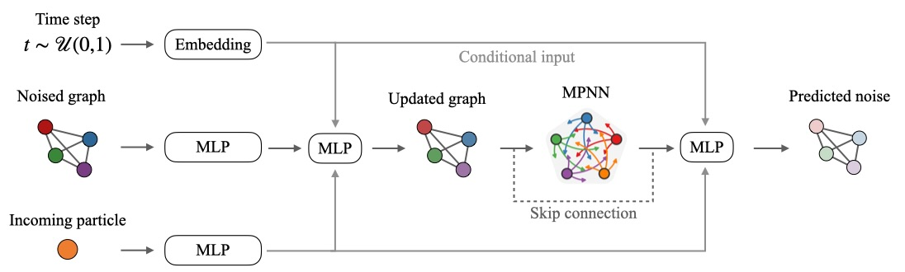

# Official repository for "CaloGraph: Graph-based diffusion model for fast shower generation in calorimeters with irregular geometry" paper


This repository contains the code for the paper "CaloGraph: Graph-based diffusion model for fast shower generation in calorimeters with irregular geometry", [arXiv:2402.11575](https://arxiv.org/abs/2402.11575).



## Evaluation

The evaluation script is provided in the `eval.py` file. The script can be run as follows:

```bash
    python eval.py -d <1-pions, 1-photons> \
    -n <number_of_events> -bs <batch_size> \
    -o <output_folder_name> [--no_cuda] [--which_cuda <device_number>]
```

Pre-trained models used in the paper can be found in the `saved_models` folder.
